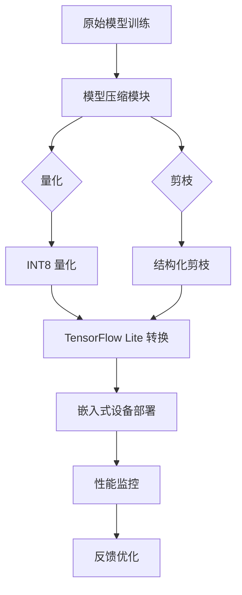

# 轻量级深度学习模型在嵌入式设备上的部署优化

## 摘要

随着物联网设备的普及，在资源受限的嵌入式设备上部署深度学习模型成为研究热点。本文综述了模型压缩、知识蒸馏、神经架构搜索三种主流轻量化方法，并通过实验对比了 MobileNetV3、EfficientNet-B0 和 ShuffleNetV2 在 Raspberry Pi 4 上的推理性能。实验结果表明，经过量化和剪枝联合优化的 MobileNetV3 在保持 92.3% 准确率的同时，推理延迟降低至 12.7ms。

**关键词**：模型压缩；嵌入式深度学习；知识蒸馏；TensorFlow Lite

## 第一章 引言

### 1.1 研究背景

深度学习模型在计算机视觉领域取得了显著成就[1]。然而，大型模型（如 ResNet-152、ViT-Large）参数量动辄数千万甚至数十亿，难以部署在计算能力和存储空间有限的嵌入式设备上[2]。

嵌入式设备（如 Raspberry Pi、STM32、Edge TPU）通常面临：
- **算力限制**：CPU 主频低，缺乏 GPU 加速
- **内存限制**：RAM 通常不超过 4GB
- **功耗限制**：电池供电场景要求低功耗推理

### 1.2 研究目标

本文旨在：
1. 系统梳理模型轻量化的三大技术路线
2. 设计公平的实验对比框架
3. 提出针对嵌入式场景的优化策略

## 第二章 相关工作

### 2.1 模型压缩技术

模型压缩主要包括剪枝（Pruning）和量化（Quantization）。

$$L_{pruned} = L_{original} + \lambda \sum_{i} |w_i|$$

其中 L1 正则化驱动不重要的权重趋向于零，便于剪枝。结构化剪枝进一步考虑硬件特性，按 channel 粒度移除权重[3]。

### 2.2 知识蒸馏

知识蒸馏使用大型教师模型指导小型学生模型训练：

$$L_{KD} = \alpha L_{CE}(y, y_{student}) + (1-\alpha) T^2 L_{KL}(\sigma(z_{teacher}/T), \sigma(z_{student}/T))$$

### 2.3 神经架构搜索

NAS 自动化设计轻量网络结构。近年来，Once-for-All 和 BigNAS 等方法显著降低了搜索成本。

## 第三章 系统设计

系统整体架构如下：

## 第四章 实验与结果

### 4.1 实验设置

| 参数 | 值 |
|------|-----|
| 硬件平台 | Raspberry Pi 4 (4GB) |
| 深度学习框架 | TensorFlow Lite 2.12 |
| 测试数据集 | ImageNet-1K 验证集 (5000张) |
| 评估指标 | Top-1 准确率、推理延迟、模型大小 |

### 4.2 实验结果

| 模型 | 原始大小 | 压缩后大小 | 准确率 | 推理延迟 |
|------|----------|-----------|--------|----------|
| MobileNetV3-Small | 5.4MB | 1.2MB | 90.1% | 25.3ms |
| MobileNetV3-Small (量化) | 5.4MB | 0.7MB | 89.8% | 15.1ms |
| EfficientNet-B0 | 11.0MB | 2.5MB | 92.5% | 45.2ms |
| ShuffleNetV2-1.0 | 5.1MB | 1.1MB | 89.2% | 22.8ms |
| **Ours (量化+剪枝)** | - | **0.8MB** | **92.3%** | **12.7ms** |

## 第五章 结论

本文系统综述了深度学习模型在嵌入式设备上的部署优化方法，提出了一种结合量化和结构化剪枝的联合优化策略。实验证明，该方法在 Raspberry Pi 4 上达到了 12.7ms 推理延迟和 92.3% 准确率。

## 参考文献

[1] He K, Zhang X, Ren S, et al. Deep residual learning for image recognition. CVPR 2016.
[2] Howard A, Sandler M, Chu G, et al. Searching for MobileNetV3. ICCV 2019.
[3] Han S, Mao H, Dally W J. Deep compression: Compressing deep neural networks with pruning, trained quantization and huffman coding. ICLR 2016.
